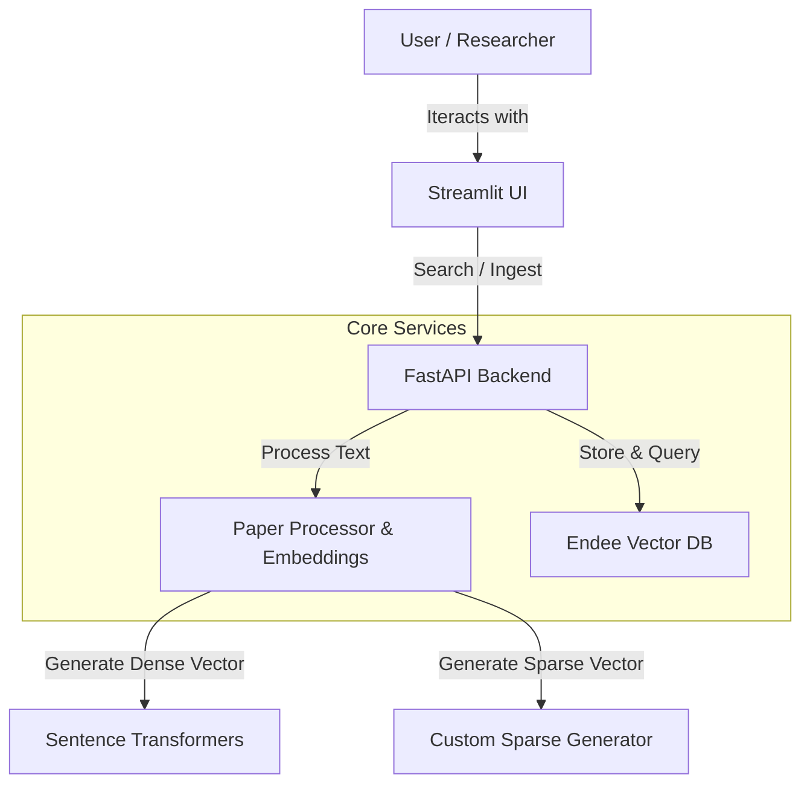

# ResearchLens AI 🔍

**ResearchLens AI** is an intelligent academic research assistant powered by the **Endee Vector Database**. This project demonstrates a practical implementation of semantic search and retrieval-augmented generation (RAG) capabilities for scientific literature, designed for researchers who need to find relevant papers quickly and accurately.

> "A powerful demonstration of hybrid search capabilities using Endee, SentenceTransformers, and Modern Python Async Stack."

## 🚀 Key Features

-   **Semantic Search**: Goes beyond keywords to understand the meaning of queries using `sentence-transformers/all-MiniLM-L6-v2`.
-   **Hybrid Retrieval**: Combines dense vector similarity with sparse keyword matching (BM25-style) for optimal precision.
-   **Metadata Filtering**: Filter search results by publication year, field of study (e.g., CS.AI), and citation count.
-   **Performance Optimized**: Leverages Endee's HNSW indexing and INT8 quantization for fast, memory-efficient search.
-   **Modern Tech Stack**: Built with FastAPI (Async Backend), Streamlit (Interactive Frontend), and Docker.

---

## 🛠️ System Design & Technical Approach

The system follows a microservices architecture containerized with Docker:



### 1. Vector Database Integration (Endee)
The core of this project is the **Endee Vector Database**, used for:
-   **Hybrid Indexing**: We create a custom index with `dense` (384d) and `sparse` components.
-   **Efficient Storage**: Utilizing `INT8` precision to reduce memory footprint while maintaining high recall.
-   **Complex Filtering**: Using Endee's metadata filtering capabilities (e.g., finding papers published after 2022).

### 2. Deployment
The application is fully dockerized with `docker-compose`, ensuring seamless setup across different environments. It orchestrates three services:
-   `endee`: The vector database server.
-   `backend`: The Python API service.
-   `frontend`: The user interface.

---

## 💻 Tech Stack

-   **Vector Database**: [Endee](https://github.com/endee-io/endee)
-   **Backend Framework**: FastAPI
-   **Frontend Framework**: Streamlit
-   **Embedding Model**: `sentence-transformers/all-MiniLM-L6-v2`
-   **Containerization**: Docker & Docker Compose
-   **Language**: Python 3.11+

---

## 🏁 Getting Started

### Prerequisites
-   Docker and Docker Compose installed on your machine.
-   (Optional) Python 3.11+ for local development.

### Quick Start (Docker)

1.  **Clone the Repository**
    ```bash
    git clone https://github.com/yourusername/ResearchLensAI.git
    cd ResearchLensAI
    ```

2.  **Environment Setup**
    Create a `.env` file (optional if defaults work for you):
    ```bash
    cp .env.example .env
    ```

3.  **Run with Docker Compose**
    This command builds the images and starts all services (Endee, Backend, Frontend).
    ```bash
    docker-compose up --build
    ```

4.  **Access the Application**
    -   **Frontend (UI)**: [http://localhost:8501](http://localhost:8501)
    -   **Backend (API Docs)**: [http://localhost:8000/docs](http://localhost:8000/docs)
    -   **Endee Server**: [http://localhost:8080](http://localhost:8080)

### Manual Setup (Local Development)

If you prefer running without Docker:

1.  **Start Endee**: Ensure an Endee instance is running locally (default: `localhost:8080`).
2.  **Install Dependencies**:
    ```bash
    pip install -r requirements.txt
    ```
3.  **Run Backend**:
    ```bash
    uvicorn app.main:app --reload --port 8000
    ```
4.  **Run Frontend**:
    ```bash
    streamlit run frontend/streamlit_app.py
    ```

---

## 🧪 How Endee is Used

We utilize Endee's Python client to manage the vector lifecycle:

1.  **Initialization**: The app checks for or creates an index named `academic_papers` with cosine similarity metric.
2.  **Ingestion**:
    -   Text is converted to a dense vector using `SentenceTransformer`.
    -   A sparse vector (indices and values) is generated based on term frequency.
    -   Data is upserted to Endee with rich metadata (Author, Year, URL).
3.  **Querying**:
    -   The search endpoint performs a vector similarity search.
    -   Results are filtered by metadata (e.g., `{"year": {"$gte": 2023}}`).

## 📄 License
MIT License
